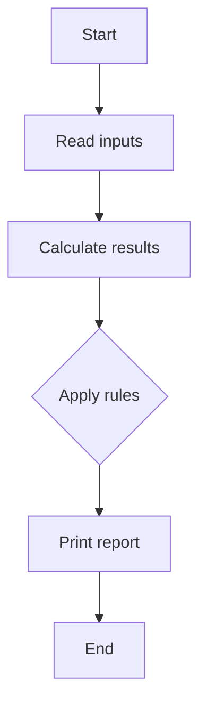

# Flowcharts

```mermaid
flowchart TD
  A[Start] --> B[Read inputs]
  B --> C[Calculate results]
  C --> D{Apply rules}
  D --> E[Print report]
  E --> F[End]
```

Detailed logic for cases 1-10 is provided in `algorithms_and_pseudocode.md`. Each program follows this start, input, compute, decision, output, and end structure.
